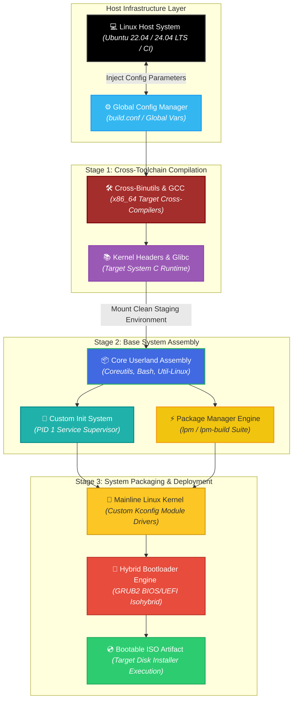

<div align="center">

# 🐧 ShreeOS

### Experimental Independent Source-Built Linux Distribution with Custom Init, LPM Package Manager & Desktop Suite

**ShreeOS** is an independent, source-built x86_64 Linux operating system engineered from the ground up without relying on prebuilt binary distributions. It automates the compilation of a cross-toolchain, mainline Linux kernel, custom PID 1 init system with Unix socket IPC, and native package manager (`lpm`), providing a unified desktop environment and bootable hybrid BIOS/UEFI ISO.

<p align="center">
  
  
  
  
  
</p>

<p align="center">
  <a href="https://github.com/shreeharsh-patil/shreeos/stargazers"></a>
  <a href="https://github.com/shreeharsh-patil/shreeos/issues"></a>
  <a href="LICENSE"></a>
</p>

</div>

---

## 🏛️ Operating System Architecture & Compilation Topology

Building ShreeOS from source uses a three-stage bootstrap process:

1. **Stage 1 (Cross-Toolchain):** Compiles cross-binutils, cross-GCC, and Linux kernel headers targeting `x86_64-shreeos-linux-gnu`.
2. **Stage 2 (Base Userland):** Compiles base packages (Coreutils, Bash, Util-Linux, Glibc runtime) inside an isolated build staging root.
3. **Stage 3 (Desktop, Init & Packaging):** Compiles the mainline Linux kernel, PID 1 supervisor, `lpm` package manager, desktop suite, and hybrid BIOS/UEFI bootloader image.



### 🔄 System Initialization & Service Lifecycle

```mermaid
sequenceDiagram
    autonumber
    actor User as Hardware / QEMU
    participant Boot as GRUB2 Bootloader
    participant Kernel as Linux Kernel Matrix
    participant Init as Custom Init (PID 1)
    participant Service as Service Supervisor
    participant Desktop as Window Manager Shell

    User->>Boot: Power On / Select ShreeOS Entry
    Boot->>Kernel: Load bzImage & Initramfs Payload
    Kernel->>Kernel: Initialize Hardware Drivers & Mount RootFS
    Kernel->>Init: Execute PID 1 Handoff (/sbin/init)
    
    rect rgb(20, 30, 20)
        note over Init,Service: System Initialization Lifecycle
        Init->>Init: Mount /proc, /sys, /dev Pseudo Filesystems
        Init->>Service: Parse Service Descriptors (/etc/services.d/*.conf)
        Service->>Service: Start Daemons & Open Socket IPC (/run/init.sock)
    end

    rect rgb(30, 20, 40)
        note over Service,Desktop: Userland Presentation Layer
        Service->>Desktop: Authenticate User (shree-auth) & Start Session
        Desktop-->>User: Present Restrained Desktop Environment
    end
```



## 🛠️ Subsystems & Specifications

| Subsystem Component | Architecture & Purpose |
|---|---|
| 🛠️ Native Toolchain | Cross-compiled GNU Binutils and GCC targeting `x86_64-shreeos-linux-gnu` with isolated search paths. |
| 🧠 Custom Init (PID 1) | C-based init daemon with non-blocking zombie reaping (`waitpid`), process group signal routing, service logging (`/var/log/shreeos/services/`), and Unix socket IPC (`/run/init.sock`). |
| 📦 lpm Package Manager | Custom package manager with SHA-256 integrity verification, transactional staging, file conflict detection, and `/var/lib/lpm/lock` locking. |
| 💿 Hybrid ISO Builder | Isohybrid image with dual GRUB2 boot paths (`i386-pc` for BIOS and `x86_64-efi` for UEFI). |

## 🚀 Build Guide & Local Execution

### Prerequisites

- **Host System:** Linux (Ubuntu 22.04 / 24.04 LTS or equivalent)
- **Core Dependencies:** `git`, `make`, `gcc`, `g++`, `bash`, `bison`, `flex`, `gawk`, `texinfo`, `wget`, `curl`, `xorriso`, `qemu-system-x86_64`
- **Storage:** ~30 GB free disk space.

### Building ShreeOS

```bash
git clone https://github.com/shreeharsh-patil/shreeos.git
cd shreeos

# Build full desktop ISO profile
make PROFILE=desktop iso

# Or build minimal headless profile
make PROFILE=minimal iso
```

### Testing & Validation

```bash
# Run all test suites (unit tests + security + auth + installer + desktop)
make test-all

# Launch built ISO in QEMU (UEFI mode)
make qemu

# Launch built ISO in QEMU (BIOS mode)
make qemu-bios
```

## 📁 Repository Directory Architecture

```
shreeos/
├─ build.conf                       (Central Configuration File)
├─ Makefile                         (Root Build Script Orchestration)
├─ toolchain/                       (Cross-compilation toolchain: binutils, gcc, glibc)
├─ base-system/                     (Core userland: coreutils, bash, util-linux)
├─ kernel/                          (Linux kernel configs, patches, and build scripts)
├─ rootfs/                          (Root filesystem assembly and skeleton scripts)
├─ init/                            (Custom C-based PID 1 init system and service configs)
├─ pkgmanager/                      (Native lpm package manager source and test suites)
├─ repo-tools/                      (Package indexing & archive tooling)
├─ installer/                       (Target disk installer and partitioning safeguards)
├─ iso-builder/                     (Hybrid BIOS/UEFI ISO generation framework)
├─ desktop/                         (Window manager, control center, launcher, file manager)
├─ branding/                        (Design system tokens, vector icons, wallpapers)
├─ tests/                           (Security, authentication, installer, and smoke tests)
└─ scripts/                         (shreectl, shree-doctor, shreeinfo utilities)
```

## ⚖️ License & Attribution

Distributed under the terms of the MIT License. Third-party components built from source (Linux kernel, GNU toolchain, core libraries) retain their respective upstream software licenses (GPLv2, GPLv3, LGPL, etc.).

## 👤 Project Author

**Developed and Maintained by Shreeharsh Patil.**
- **GitHub:** [github.com/shreeharsh-patil](https://github.com/shreeharsh-patil)
