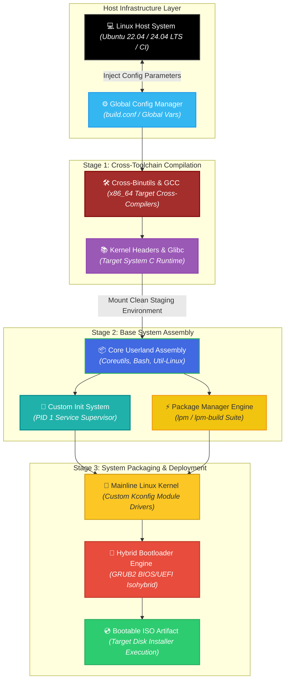

<div align="center">

# 🐧 ShreeOS

### Experimental Independent Source-Built Linux Distribution with Custom Init, LPM Package Manager & Desktop Suite

**ShreeOS** is an independent, source-built x86_64 Linux operating system engineered from the ground up without relying on prebuilt binary distributions. It automates the compilation of a cross-toolchain, mainline Linux kernel, custom PID 1 init system with Unix socket IPC, and native package manager (`lpm`), providing a unified desktop environment and bootable hybrid BIOS/UEFI ISO.

<p align="center">
  
  
  
  
  
</p>

<p align="center">
  <a href="https://github.com/shreeharsh-patil/shreeos/stargazers"></a>
  <a href="https://github.com/shreeharsh-patil/shreeos/issues"></a>
  <a href="LICENSE"></a>
</p>

</div>

---

## 🏛️ Operating System Architecture & Compilation Topology

Building ShreeOS from source uses a three-stage bootstrap process:

1. **Stage 1 (Cross-Toolchain):** Compiles cross-binutils, cross-GCC, and Linux kernel headers targeting `x86_64-shreeos-linux-gnu`.
2. **Stage 2 (Base Userland):** Compiles base packages (Coreutils, Bash, Util-Linux, Glibc runtime) inside an isolated build staging root.
3. **Stage 3 (Desktop, Init & Packaging):** Compiles the mainline Linux kernel, PID 1 supervisor, `lpm` package manager, desktop suite, and hybrid BIOS/UEFI bootloader image.



### 🔄 System Initialization & Service Lifecycle

```mermaid
sequenceDiagram
    autonumber
    actor User as Hardware / QEMU
    participant Boot as GRUB2 Bootloader
    participant Kernel as Linux Kernel Matrix
    participant Init as Custom Init (PID 1)
    participant Service as Service Supervisor
    participant Desktop as Window Manager Shell

    User->>Boot: Power On / Select ShreeOS Entry
    Boot->>Kernel: Load bzImage & Initramfs Payload
    Kernel->>Kernel: Initialize Hardware Drivers & Mount RootFS
    Kernel->>Init: Execute PID 1 Handoff (/sbin/init)
    
    rect rgb(20, 30, 20)
        note over Init,Service: System Initialization Lifecycle
        Init->>Init: Mount /proc, /sys, /dev Pseudo Filesystems
        Init->>Service: Parse Service Descriptors (/etc/services.d/*.conf)
        Service->>Service: Start Daemons & Open Socket IPC (/run/init.sock)
    end

    rect rgb(30, 20, 40)
        note over Service,Desktop: Userland Presentation Layer
        Service->>Desktop: Authenticate User (shree-auth) & Start Session
        Desktop-->>User: Present Restrained Desktop Environment
    end
```



## 🛠️ Subsystems & Specifications

| Subsystem Component | Architecture & Purpose |
|---|---|
| 🛠️ Native Toolchain | Cross-compiled GNU Binutils and GCC targeting `x86_64-shreeos-linux-gnu` with isolated search paths. |
| 🧠 Custom Init (PID 1) | C-based init daemon with non-blocking zombie reaping (`waitpid`), process group signal routing, service logging (`/var/log/shreeos/services/`), and Unix socket IPC (`/run/init.sock`). |
| 📦 lpm Package Manager | Custom package manager with SHA-256 integrity verification, transactional staging, file conflict detection, and `/var/lib/lpm/lock` locking. |
| 💿 Hybrid ISO Builder | Isohybrid image with dual GRUB2 boot paths (`i386-pc` for BIOS and `x86_64-efi` for UEFI). |

## 🚀 Build, Test & Installation Guide

### Current Build Status

ShreeOS is still experimental. The **minimal** profile is the recommended build
and installation target while the target-native desktop graphics stack is being
completed. The desktop profile can be used for development/integration testing,
but it is not considered a certified GUI image until target X11/Xft/Xinerama,
Fontconfig, FreeType, Xorg, xinit and fonts are present.

### Supported Build Hosts

- **Recommended:** Ubuntu 22.04 LTS or Ubuntu 24.04 LTS on x86_64.
- **Windows:** WSL2 with Ubuntu is supported for building. Keep the repository
  under the WSL Linux filesystem (for example `~/ShreeOS`), not `/mnt/c`.
- **Disk space:** at least 15 GB free; **30–50 GB recommended** for a full build.
- **Memory:** 8 GB RAM recommended.
- **CPU:** 4 or more threads recommended.

ShreeOS builds a cross-toolchain and target userland from source. Host X11 or
other development packages are build tools only; they do not replace missing
ShreeOS-target libraries.

### 1. Clone the Repository

```bash
git clone https://github.com/shreeharsh-patil/ShreeOS.git
cd ShreeOS
```

### 2. Install Host Dependencies

On Ubuntu/Debian:

```bash
sudo bash scripts/install-build-deps-apt.sh
```

This installs the compiler/build tools, GRUB BIOS/UEFI tooling, QEMU, OVMF,
filesystem utilities, ISO tooling, ShellCheck, and the libraries needed by the
host-side build process.

On WSL2 you can instead run:

```bash
make bootstrap-wsl
```

If WSL reports that the repository is under `/mnt/c`, move or clone it into
the Linux filesystem:

```bash
cd ~
git clone https://github.com/shreeharsh-patil/ShreeOS.git
cd ShreeOS
```

### 3. Verify the Host Before Building

```bash
# Normal diagnostics
make doctor

# Strict diagnostics: includes QEMU, OVMF and installer prerequisites
bash scripts/doctor.sh --strict
```

Do not continue with a real disk installation while strict diagnostics report
required-tool failures.

### 4. Verify and Fetch Pinned Sources

```bash
bash scripts/verify-sources.sh --fetch
```

The source verifier checks the pinned upstream package metadata and validates
downloaded archives before compilation.

### 5. Build the Recommended Minimal ISO

The reliable build entry point runs strict diagnostics, verifies/fetches sources,
builds the selected profile, and validates the resulting ISO:

```bash
bash scripts/build.sh minimal
```

Equivalent manual commands:

```bash
make PROFILE=minimal iso
make PROFILE=minimal verify-iso
```

Build output is written under `out/`, including:

```text
out/shreeos-<version>.iso
out/shreeos-<version>.iso.sha256
out/shreeos-<version>-manifest.json
```

### 6. Desktop Development Build

The strict desktop build deliberately stops when the ShreeOS **target** graphics
stack is incomplete:

```bash
bash scripts/build.sh desktop
```

For explicit desktop integration work only, deferred graphics can be permitted:

```bash
ALLOW_DEFERRED_GRAPHICS=1 make PROFILE=desktop iso
```

A deferred desktop ISO must not be treated as a finished/certified desktop
release.

### 7. Test the Build

Run fast/non-destructive suites:

```bash
make test-unit
make test-init
make test-security
make test-auth
make test-installer
make test-pkgmanager
make test-desktop
make test-hardware
make test-smoke
```

After building the ISO, validate boot paths:

```bash
make PROFILE=minimal verify-iso
make qemu       # UEFI
make qemu-bios  # Legacy BIOS
```

For the strict QEMU installation-and-boot path:

```bash
REQUIRE_ARTIFACTS=1 bash tests/qemu/test-e2e-install-and-boot.sh
```

### 8. Install ShreeOS to a Disk

> [!CAUTION]
> The installer repartitions and formats the selected target disk. **All data on
> that disk will be destroyed.** Verify the whole-disk device carefully before
> confirming. Do not use a partition such as `/dev/nvme0n1p1` as the target.

The current installer is run from a **completed ShreeOS source/build tree**.
The bootable ISO is useful for boot validation, but the installer is not yet a
self-contained live-ISO installer.

First identify the target disk:

```bash
lsblk -o NAME,SIZE,TYPE,FSTYPE,MOUNTPOINTS,MODEL
```

#### Recommended: guided installer

```bash
sudo bash installer/scripts/installer-tui.sh
```

The TUI:

1. shows system/hardware information;
2. lists candidate whole disks and rejects detected active/mounted targets;
3. collects hostname, username, root password and user password;
4. validates the timezone;
5. shows a destructive-operation summary and requires confirmation;
6. partitions/formats the disk, copies ShreeOS, installs GRUB and verifies the
   final installation.

#### Scripted installer

See all supported options:

```bash
bash installer/scripts/install-to-disk.sh --help
```

Syntax:

```text
install-to-disk.sh <disk-device>
  [--yes]
  [--hostname=<name>]
  [--timezone=<zone>]
  [--credentials-file=<path>]
  [--username=<name>]
  [--boot-mode=both|uefi|bios]
```

Passwords are intentionally not accepted on the command line. Create a protected
credentials file instead:

```bash
umask 077

read -r -s -p "Root password: " ROOT_PW
printf '\n'
read -r -s -p "User password: " USER_PW
printf '\n'

printf '%s\n%s\n' "$ROOT_PW" "$USER_PW" > /tmp/shreeos-credentials
unset ROOT_PW USER_PW
chmod 600 /tmp/shreeos-credentials
```

Then install. Replace `/dev/nvme0n1` with the **whole target disk**:

```bash
sudo bash installer/scripts/install-to-disk.sh /dev/nvme0n1 --yes \
  --hostname=shreeos \
  --timezone=Asia/Kolkata \
  --username=shree \
  --credentials-file=/tmp/shreeos-credentials \
  --boot-mode=both

rm -f /tmp/shreeos-credentials
```

The credentials file must be a regular non-symlink file, owned by the invoking
user, with mode exactly `0600`. Line 1 is the root password; optional line 2
is the primary user's password.

Boot modes:

| Mode | Behavior |
|---|---|
| `both` | Default. Installs both UEFI and legacy BIOS GRUB; both paths must succeed. |
| `uefi` | Installs x86_64 UEFI GRUB to the EFI System Partition. |
| `bios` | Installs legacy i386-pc GRUB to the target disk. |

Before reporting success, the installer verifies the installed kernel,
initramfs, GRUB configuration, root filesystem UUID/`fstab`, and credential
file permissions.

### Build Recovery & Troubleshooting

| Problem | Recommended action |
|---|---|
| WSL build is under `/mnt/c` | Re-clone to `~/ShreeOS`; Windows-mounted filesystems are slower and less reliable for this build. |
| Missing host command/tool | Run `sudo bash scripts/install-build-deps-apt.sh`, then `bash scripts/doctor.sh --strict`. |
| Source download/checksum issue | Run `bash scripts/verify-sources.sh --fetch` again. Do not bypass checksum failures. |
| Base-system build is stale/broken | Run `make clean-base`, then rebuild. |
| Toolchain is stale/broken | Run `make clean-toolchain`, then rebuild. |
| Kernel build is stale/broken | Run `make clean-kernel`, then rebuild. |
| Desktop graphics readiness fails | Use `PROFILE=minimal` for the supported path; desktop certification is intentionally deferred. |
| ISO validation fails | Run `make clean-iso && make PROFILE=minimal iso && make PROFILE=minimal verify-iso`. |
| Installer refuses the target disk | Check mounts/swap with `lsblk` and `findmnt`; do not bypass active-disk safety checks. |
| Installation is interrupted | Treat the target as incomplete; correct the problem and rerun installation before attempting to boot it. |

Targeted cleanup commands:

```bash
make clean-desktop
make clean-kernel
make clean-base
make clean-toolchain
make clean-iso

# Full reset (removes build/ and out/)
make distclean
```

Useful diagnostics:

```bash
make doctor
make verify-sources
make graphics
make PROFILE=minimal verify-iso
```

## 📁 Repository Directory Architecture

```
shreeos/
├─ build.conf                       (Central Configuration File)
├─ Makefile                         (Root Build Script Orchestration)
├─ toolchain/                       (Cross-compilation toolchain: binutils, gcc, glibc)
├─ base-system/                     (Core userland: coreutils, bash, util-linux)
├─ kernel/                          (Linux kernel configs, patches, and build scripts)
├─ rootfs/                          (Root filesystem assembly and skeleton scripts)
├─ init/                            (Custom C-based PID 1 init system and service configs)
├─ pkgmanager/                      (Native lpm package manager source and test suites)
├─ repo-tools/                      (Package indexing & archive tooling)
├─ installer/                       (Target disk installer and partitioning safeguards)
├─ iso-builder/                     (Hybrid BIOS/UEFI ISO generation framework)
├─ desktop/                         (Window manager, control center, launcher, file manager)
├─ branding/                        (Design system tokens, vector icons, wallpapers)
├─ tests/                           (Security, authentication, installer, and smoke tests)
└─ scripts/                         (shreectl, shree-doctor, shreeinfo utilities)
```

## ⚖️ License & Attribution

Distributed under the terms of the MIT License. Third-party components built from source (Linux kernel, GNU toolchain, core libraries) retain their respective upstream software licenses (GPLv2, GPLv3, LGPL, etc.).

## 👤 Project Author

**Developed and Maintained by Shreeharsh Patil.**
- **GitHub:** [github.com/shreeharsh-patil](https://github.com/shreeharsh-patil)
