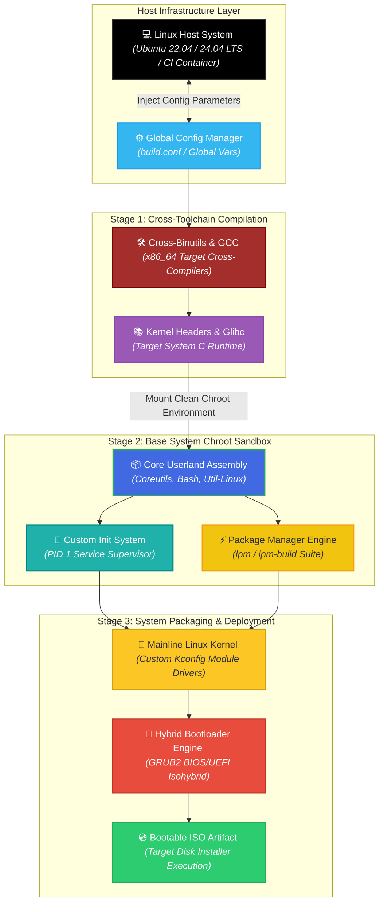

<div align="center">

# 🐧 ShreeOS

### Enterprise-Grade From-Scratch Linux Distribution, Custom Toolchain Engine & Reproducible Kernel Architecture

**ShreeOS** is an independent, source-built x86_64 Linux operating system engineered from the ground up without relying on prebuilt distributions like Debian, Arch, or Fedora. Inspired by the principles of Linux From Scratch (LFS), the platform automates the creation of a cross-compilation toolchain, a mainline Linux kernel, a custom PID 1 init system, and a native package manager (`lpm`), culminating in a bootable hybrid BIOS/UEFI ISO compiled entirely via CI/CD pipelines.

<p align="center">
  
  
  
  
  
</p>

<p align="center">
  <a href="https://github.com/shreeharsh-patil/shreeos/stargazers"></a>
  <a href="https://github.com/shreeharsh-patil/shreeos/issues"></a>
  <a href="LICENSE"></a>
</p>

</div>

---

## 🏛️ Operating System Architecture & Compilation Topology

Building a distribution from source requires complete isolation between the host environment and the target userland. **ShreeOS** enforces strict build isolation using a **Three-Stage Bootstrap Process**:

1. **Stage 1 (Host Toolchain):** Compiles cross-binutils, cross-GCC, and target C library headers natively on the host platform.
2. **Stage 2 (Isolated Chroot Environment):** Re-compiles a native compiler targeting `x86_64-shreeos-linux-gnu` inside a clean `chroot` sandbox.
3. **Stage 3 (System Assembly):** Compiles the mainline Linux kernel, system utilities, custom PID 1 init, and native `lpm` package management binaries to construct the final bootable ISO file system.



> [!NOTE]
> **Dynamic Rebranding Design:** The entire system architecture uses a centralized config interface (`build.conf`). All binaries, directory flags, package indicators, and system scripts reference the `DISTRO_NAME` variable directly, enabling full system rebranding with a single configuration edit.

### 🔄 System Initialization & Service Lifecycle

The sequence blueprint below shows the complete system startup process, starting from hardware initialization to PID 1 handoff and userland desktop rendering:

```mermaid
sequenceDiagram
    autonumber
    actor User as Hardware / QEMU
    participant Boot as GRUB2 Bootloader
    participant Kernel as Linux Kernel Matrix
    participant Init as Custom Init (PID 1)
    participant Service as Service Supervisor
    participant Desktop as Window Manager Shell

    User->>Boot: Power On / Select ShreeOS Entry
    Boot->>Kernel: Load bzImage & Initramfs Payload
    Kernel->>Kernel: Initialize Hardware Drivers & Mount RootFS
    Kernel->>Init: Execute PID 1 Handoff (/sbin/init)
    
    rect rgb(20, 30, 20)
        note over Init,Service: System Initialization Lifecycle
        Init->>Init: Mount /proc, /sys, /dev Pseudo Filesystems
        Init->>Service: Parse Service Manifests (/etc/init.d/*)
        Service->>Service: Resolve Startup Dependencies & Spawn Daemons
    end

    rect rgb(30, 20, 40)
        note over Service,Desktop: Userland Presentation Layer
        Service->>Desktop: Launch Display Server & Window Manager
        Desktop-->>User: Present Minimal Responsive Graphical Environment
    end
```



## 🛠️ Custom Subsystems & Tooling Specifications

| Subsystem Component | Technical Challenge | ShreeOS Architectural Solution |
|---|---|---|
| 🛠️ Native Toolchain | Preventing host system contamination during stage-1 package compilation. | Builds isolated, cross-compiled GNU Binutils and GCC binaries targeting `x86_64-shreeos-linux-gnu` with restricted search paths. |
| 🧠 Custom Init (PID 1) | Managing process supervision, signal handling, and service order without systemd complexity. | Features a lightweight C-based init daemon that manages zombie process reaping (`waitpid`), signal trapping, and dependency ordering. |
| 📦 lpm Package Manager | Handling updates, metadata tracking, and dependency resolution on a custom distribution. | Implements a custom package management utility with dependency tree calculation, SHA-256 verification, and atomic package extraction. |
| 💿 Hybrid ISO Builder | Booting reliably across both legacy BIOS and modern UEFI hardware architectures. | Generates an isohybrid disk image with dual GRUB2 boot paths (`i386-pc` for BIOS and `x86_64-efi` for UEFI systems). |

## 🎨 Interface & Build Pipeline Showcase

### 🚀 Build Guide & Local Execution

#### Prerequisites & Host Tooling

- **Recommended Host System:** Ubuntu 22.04 LTS or 24.04 LTS (64-bit)
- **Core Tooling Dependencies:** `git`, `make`, `gcc`, `g++`, `bash`, `bison`, `flex`, `gawk`, `texinfo`, `wget`, `curl`, `xorriso`, `qemu-system-x86_64`
- **Hardware Storage Bounds:** Minimum ~30 GB free disk space and 4+ CPU cores recommended for fast toolchain compilation.

#### Step-by-Step Compilation

**1. Repository Setup & Configuration**

Clone the repository and inspect system parameters:

```bash
git clone https://github.com/shreeharsh-patil/shreeos.git
cd shreeos

# Review core variables (Target Arch, Toolchain Versions, Name Parameters)
cat build.conf
```

**2. Query Pipeline Targets**

Review the available automated targets managed through the root build framework:

```bash
make help
```

**3. Execute Toolchain & System Build**

Run the automated build sequence to construct the toolchain, kernel, base system, and package manager:

```bash
# Compile Stage-1 & Stage-2 Toolchain Ecosystems
make toolchain

# Build Core Base System, Kernel, and Utilities inside Sandbox
make base-system

# Assemble the RootFS and Package the Bootable ISO
make iso
```

**4. Emulate Bootable ISO via QEMU**

Validate the final build using the integrated QEMU test suite:

```bash
make qemu
```

## 📁 Repository Directory Architecture

```
shreeos/
├─ build.conf                       (Central Configuration File: Flags, Paths, and DISTRO_NAME)
├─ Makefile                         (Root Build Script Orchestrating Stage 1-3 Targets)
├─ toolchain/                       (Cross-compilation toolchain: binutils, gcc, glibc)
├─ base-system/                     (Core userland compilation specs: coreutils, bash, util-linux)
├─ kernel/                          (Mainline Linux kernel configs, patches, and build hooks)
├─ rootfs/                          (Root filesystem structure and layout scripts)
├─ init/                            (Custom C-based PID 1 init system and service scripts)
├─ pkgmanager/                      (Native lpm package manager source code)
├─ repo-tools/                      (Package packaging tooling: lpm-build & index generators)
├─ installer/                       (Guided terminal-based system disk installer)
├─ iso-builder/                     (Hybrid BIOS/UEFI ISO generation framework)
├─ desktop/                         (Minimal desktop environment, window manager, & themes)
├─ branding/                        (Logos, wallpapers, system release parameters)
├─ update/                          (System update mechanism)
├─ tests/                           (Smoke tests, automated QEMU boot validation, & unit tests)
├─ .github/workflows/               (CI/CD pipelines for automated ISO builds and testing)
├─ docs/                            (Architecture design decisions, build guides, and roadmaps)
└─ scripts/                         (Shared shell helpers used across all build stages)
```

## ⚖️ Legal Guidelines & Licensing

> [!WARNING]
> This operating system platform is distributed under the terms of the MIT License. Third-party components built from source (including the mainline Linux kernel, GNU toolchain utilities, and core libraries) retain their respective upstream software licenses (GPLv2, GPLv3, LGPL, etc.). See the `docs/design-decisions/` directory for detailed licensing and attribution notes.

## 👤 Project Author

**Developed and Maintained by Shreeharsh Patil.**

Feel free to contact me or submit issues via:

- **Email:** shreeharsh.dev@gmail.com
- **GitHub Profile:** [github.com/shreeharsh-patil](https://github.com/shreeharsh-patil)
