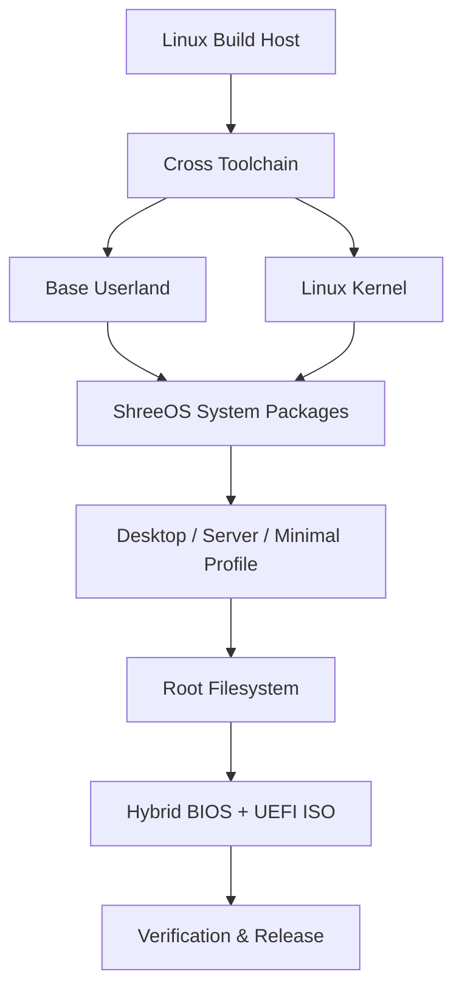
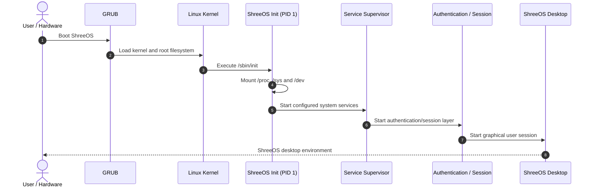

<div align="center">

# 🐧 ShreeOS

### Independent Source-Built Desktop Linux Distribution

**ShreeOS** is an independent x86_64 Linux distribution built from source with its own cross-toolchain, base userland, custom PID 1 init system, `lpm` package manager, desktop stack, installer, hardware services, and hybrid BIOS/UEFI ISO pipeline.

The project aims to provide the familiar usability and complete operating-system experience expected from mainstream desktop distributions such as Ubuntu, while keeping the ShreeOS build, branding, system architecture, package tooling, init system, and desktop implementation independent.

<p align="center">
  
  
  
  
  
</p>

<p align="center">
  <a href="https://github.com/shreeharsh-patil/ShreeOS/releases"></a>
  <a href="https://github.com/shreeharsh-patil/ShreeOS/stargazers"></a>
  <a href="https://github.com/shreeharsh-patil/ShreeOS/issues"></a>
  <a href="LICENSE"></a>
</p>

</div>

---

## ✨ What ShreeOS Is

ShreeOS is a complete Linux distribution project rather than a themed Ubuntu image or a repackaged root filesystem. Its build system produces the operating system in ordered stages and assembles the resulting components into an installable boot image.

The distribution includes:

- **Independent source-built toolchain** targeting `x86_64-shreeos-linux-gnu`.
- **Linux kernel** configured and built for ShreeOS.
- **GNU/Linux base userland** assembled into a dedicated ShreeOS root filesystem.
- **Custom PID 1 init and service supervisor** with Unix socket IPC and service logging.
- **`lpm` package manager** with integrity verification and transactional installation safeguards.
- **Native desktop profile** with the ShreeOS desktop suite and target graphics stack.
- **Authentication and session startup** integrated with the desktop environment.
- **Hardware service layer** and system utilities.
- **Guided disk installer** that partitions the target disk, installs the system, configures GRUB, and prepares first boot.
- **Hybrid BIOS + UEFI ISO output** suitable for virtual machines and compatible x86_64 PCs.
- **Automated verification** covering build stages, security, authentication, package management, installer behavior, desktop checks, ISO structure, and QEMU boot paths.

> **ShreeOS is not based on Ubuntu.** Ubuntu 22.04/24.04 LTS is supported as a convenient build host, but the generated ShreeOS target system uses its own toolchain, sysroot, root filesystem, init, package manager, desktop components, branding, and release image.

---

## 📌 Project Status

The current development version defined by the build system is **ShreeOS 0.2.0-dev**.

The `master` branch treats the graphical desktop image as the primary release profile. The release workflow is configured to publish a desktop ISO only after the target desktop stack, root filesystem, ISO structure, checksums, BIOS boot, UEFI boot, and automated test suites pass their release checks.

ShreeOS remains under active development, so a `-dev` version should not be interpreted as having the same long-term support guarantees, hardware coverage, package repository size, or release maturity as long-established distributions such as Ubuntu. The goal is a full independent desktop distribution with a conventional install-and-use experience.

---

## 🖥️ Distribution Profiles

ShreeOS supports multiple system profiles from the same source tree:

| Profile | Purpose |
|---|---|
| `desktop` | Full graphical ShreeOS desktop distribution and primary release profile. |
| `minimal` | Small headless/rescue environment for boot, recovery, and low-level validation. |
| `server` | Headless networking/server-oriented system profile. |

The default Makefile profile is `minimal`; official desktop release builds explicitly use `PROFILE=desktop`.

---

## 🏛️ System Architecture

The build is split into seven major phases:

1. **Cross Toolchain** — Binutils, GCC, Linux headers, and target C runtime support.
2. **Base System** — Core GNU/Linux userland and target libraries.
3. **Kernel** — ShreeOS Linux kernel build and configuration.
4. **System Packages** — `lpm`, custom init, and hardware services.
5. **Desktop** — ShreeOS desktop suite and graphical target stack for the desktop profile.
6. **Root Filesystem** — Final target filesystem, services, authentication, installer assets, and system configuration.
7. **ISO** — Bootable hybrid BIOS/UEFI image plus validation metadata.



### Boot and Session Flow



---

## 🧩 Core Components

| Component | Role |
|---|---|
| **GNU Toolchain** | Binutils 2.43.1, GCC 14.2.0 and Glibc 2.40 are pinned by the central build configuration. |
| **Linux Kernel** | Linux 6.18 is currently selected by `build.conf`. |
| **ShreeOS Init** | Custom C-based PID 1 and service supervisor with process management, logging, and IPC. |
| **`lpm`** | Native ShreeOS package manager with SHA-256 verification, locking, conflict checks, and staged transactions. |
| **Desktop Suite** | ShreeOS graphical shell/window-management components, control utilities, launcher, file-management pieces, branding, and session integration. |
| **Installer** | Guided disk installer with partitioning, filesystem creation, GRUB installation, account/hostname setup, and first-boot preparation. |
| **ISO Builder** | Produces hybrid images supporting GRUB BIOS and x86_64 UEFI boot paths. |
| **Verification Suite** | Unit, smoke, security, authentication, installer, package-manager, hardware, desktop, and QEMU boot validation. |

---

## 💿 Download ShreeOS

Published images are available from the GitHub Releases page:

**https://github.com/shreeharsh-patil/ShreeOS/releases**

Each release can include:

- `shreeos-<version>.iso`
- ISO SHA-256 checksum
- build manifest
- release notes describing the exact validation performed for that image

Always read the notes attached to the specific release you download, especially while ShreeOS is on `-dev` versions.

### Verify a Downloaded ISO

```bash
sha256sum -c shreeos-<version>.iso.sha256
```

---

## 🚀 Build ShreeOS From Source

### Recommended Host

- Ubuntu 22.04 LTS or Ubuntu 24.04 LTS
- Other modern Linux environments may work if equivalent build tools are available
- WSL2 is supported for development builds when the repository lives inside the Linux filesystem

### Typical Requirements

- `git`
- `make`
- `gcc` / `g++`
- `bash`
- `bison`
- `flex`
- `gawk`
- `texinfo`
- `wget`
- `curl`
- `file`
- `xorriso`
- QEMU for boot testing
- GRUB tooling required by ISO/installer stages
- roughly **30 GB** of free build space is recommended

### Desktop Distribution Build

```bash
git clone https://github.com/shreeharsh-patil/ShreeOS.git
cd ShreeOS

# Check the host and source configuration first.
make doctor
make verify-sources

# Build the complete desktop distribution.
make PROFILE=desktop iso

# Validate the generated image and boot paths.
make PROFILE=desktop verify-iso
```

The release path does **not** enable deferred graphics. A desktop release is expected to satisfy strict target graphics readiness checks.

### Minimal Build

```bash
make PROFILE=minimal iso
```

### Server Build

```bash
make PROFILE=server iso
```

### Strict Build Script

```bash
bash scripts/build.sh desktop
```

---

## 🪟 Building on Windows with WSL2

Keep the repository inside the WSL filesystem, for example `~/ShreeOS`, instead of `/mnt/c/...`.

```bash
git clone https://github.com/shreeharsh-patil/ShreeOS.git
cd ShreeOS

make bootstrap-wsl
bash scripts/build.sh desktop
```

Useful diagnostics:

```bash
make doctor
make verify-sources
make graphics
make PROFILE=desktop verify-iso
```

---

## 🧪 Testing and Validation

Run the complete test suite:

```bash
make PROFILE=desktop test-all
```

Important individual targets include:

```bash
make test-unit
make test-security
make test-auth
make test-installer
make test-pkgmanager
make test-hardware
make test-smoke
make test-qemu
```

Launch the generated ISO manually:

```bash
# UEFI
make PROFILE=desktop qemu

# Legacy BIOS
make PROFILE=desktop qemu-bios
```

### Release Certification

The GitHub release workflow for the desktop profile is designed to require all of the following before publishing the generated bundle:

- validated toolchain stage
- complete desktop ISO build
- target desktop stage verification
- root filesystem verification
- ISO structure verification
- strict native graphics readiness
- desktop-aware automated tests
- BIOS boot verification
- UEFI boot verification
- release manifest validation
- SHA-256 checksum verification

This keeps the downloadable release path separate from a build that merely produces an ISO file.

---

## 💾 Install to a Disk

ShreeOS contains a guided text-mode installer. The installer can partition the selected disk, create the target filesystem, copy the ShreeOS system, install GRUB, and configure the initial system.

### Interactive Installer

```bash
sudo bash installer/scripts/installer-tui.sh
```

### Installer Test

```bash
bash installer/tests/test-install.sh
```

The installer test creates a blank virtual disk, installs ShreeOS, boots the installed system under QEMU, and validates the init startup marker.

> **Warning:** disk installation is destructive. Always verify the selected target device before confirming installation.

---

## 📦 Package Management

ShreeOS ships its own package-management tooling under `pkgmanager/` and `repo-tools/`.

The `lpm` design includes:

- package integrity verification
- SHA-256 checks
- transactional staging
- file-conflict detection
- database locking
- package/repository tooling for native ShreeOS packages

The project is building its own package ecosystem rather than using Ubuntu's APT repositories as the native ShreeOS package-management layer.

---

## 🔧 Useful Build Commands

```bash
# Full end-to-end build for the selected profile
make PROFILE=desktop all

# Re-check native graphics readiness
make graphics

# Rebuild only selected stages
make clean-desktop
make clean-kernel
make clean-base
make clean-toolchain
make clean-iso

# Completely reset generated build/output state
make distclean

# Force stage reconstruction
make PROFILE=desktop FORCE=1 iso
```

---

## 📁 Repository Layout

```text
ShreeOS/
├── build.conf             # Distribution versions and central build configuration
├── Makefile               # Top-level build orchestration
├── toolchain/             # Cross-binutils, GCC, target headers and runtime setup
├── base-system/           # Core target userland
├── kernel/                # Kernel config and build scripts
├── pkgmanager/            # Native lpm package manager
├── repo-tools/            # Package repository/index tooling
├── init/                  # ShreeOS PID 1 and service configuration
├── hardware/              # Hardware/system daemon components
├── desktop/               # Native ShreeOS desktop suite
├── branding/              # Visual identity, icons and wallpapers
├── rootfs/                # Final target root filesystem assembly
├── installer/             # Guided disk installer and installer tests
├── bootloader/            # Boot integration
├── iso-builder/           # Hybrid ISO construction
├── scripts/               # Build, verification and system utilities
├── tests/                 # Automated system validation
└── .github/workflows/     # CI and release automation
```

---

## 🧭 Design Goals

ShreeOS is being developed around a few clear goals:

- **Independent distribution identity** — ShreeOS is not a renamed Ubuntu installation.
- **Mainstream desktop usability** — boot, install, log in, use a graphical desktop, manage software, and maintain the system through a coherent ShreeOS experience.
- **Source reproducibility** — core components are built through an auditable staged pipeline.
- **Safe releases** — ISO publication is tied to validation rather than only successful compilation.
- **Consistent desktop design** — ShreeOS owns its desktop branding and user experience.
- **Multiple profiles** — desktop, minimal, and server builds share one maintainable source tree.
- **Virtual-machine friendly development** — QEMU-based validation is part of the normal workflow.

---

## 🤝 Contributing

Contributions that improve build reliability, hardware compatibility, package coverage, the installer, desktop usability, documentation, testing, security, or accessibility are welcome.

Before submitting a change, run the relevant checks for the area you modified. For broad system changes, prefer:

```bash
make doctor
make PROFILE=desktop test-all
make PROFILE=desktop verify-iso
```

---

## ⚖️ License and Third-Party Software

ShreeOS project code is distributed under the terms of the repository's **MIT License** unless a file states otherwise.

Third-party software built or distributed as part of the operating system retains its own upstream license. Examples include the Linux kernel, GNU toolchain components, Glibc, GRUB, and other open-source libraries and utilities.

---

## 👤 Maintainer

**Developed and maintained by Shreeharsh Patil.**

GitHub: [@shreeharsh-patil](https://github.com/shreeharsh-patil)

---

<div align="center">

### ShreeOS — an independent Linux distribution built from source.

</div>
